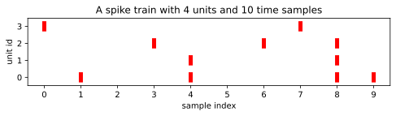

.. _synchrony:

Synchrony Metrics (:code:`synchrony`)
=====================================

Calculation
-----------
This function is providing a metric for the presence of synchronous spiking events across multiple spike trains.

The complexity is used to characterize synchronous events within the same spike train and across different spike
trains. This way synchronous events can be found both in multi-unit and single-unit spike trains.
Complexity is calculated by counting the number of spikes (i.e. non-empty bins) that occur at the same sample index,
within and across spike trains.

Synchrony metrics can be computed for different synchrony sizes (>1), defining the number of simultaneous spikes to count.

Expectation and use
-------------------

A larger value indicates a higher synchrony of the respective spike train with the other spike trains.
Larger values, especially for larger sizes, indicate a higher probability of noisy spikes in spike trains.

Technical description
-------------------
Given a spike train, consider a **unit** and a **synchrony count**. The **synchrony metric** measure the
fraction of spikes in **unit** which have the same ``sample_index`` as at least **synchrony count - 1** 
other spikes. ``compute_synchrony_metrics`` returns the **synchrony metric** for a list of ``synchrony_sizes``
and list of ``unit_ids``.

Example code
------------

.. code-block:: python

    import spikeinterface.qualitymetrics as sqm
    # Make recording, sorting and wvf_extractor object for your data.
    synchrony = sqm.compute_synchrony_metrics(waveform_extractor=wvf_extractor, synchrony_sizes=(2, 4, 8))
    # synchrony is a tuple of dicts with the synchrony metrics for each unit

Example output
--------------

A ``SortingAnalyzerz`` object named ``sa``, with the spike train shown above, would give the result

.. code-block:: python

    >>> compute_synchrony_metrics(sa, unit_ids=[0,1,3], synchrony_counts = (2,3))
    {sync_count_2: {0: 2, 1: 2, 3: 0}, sync_count_3: {0: 1, 1: 1, 3: 0}}

Links to original implementations
---------------------------------

The SpikeInterface implementation is a partial port of the low-level complexity functions from `Elephant - Electrophysiology Analysis Toolkit <https://github.com/NeuralEnsemble/elephant/blob/master/elephant/spike_train_synchrony.py#L245>`_

References
----------

.. automodule:: spikeinterface.qualitymetrics.misc_metrics

    .. autofunction:: compute_synchrony_metrics

Literature
----------

Based on concepts described in [Gruen]_
